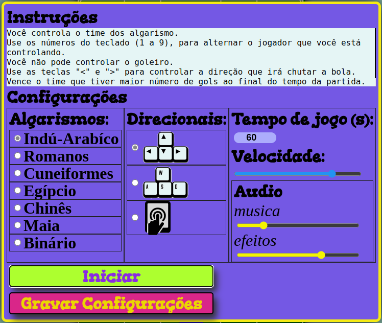
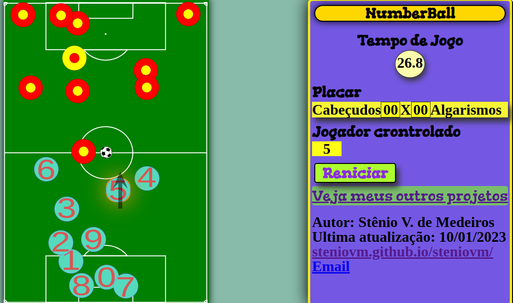
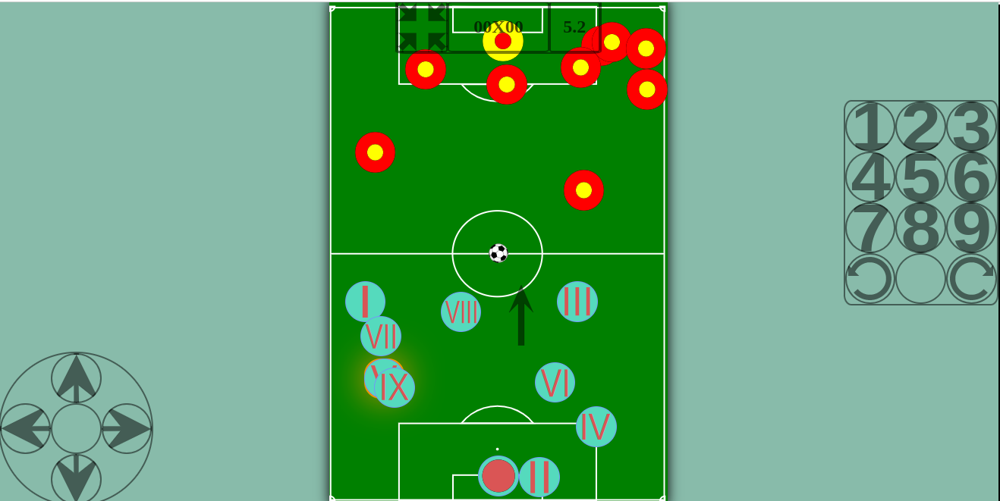

# NumberBall
Jogo educativo para trabalhar sistemas numéricos, coordenação motora e movimento browniano.

Disponível em: <a href="https://steniovm.github.io/steniovm/NumberBall/" alt="link para o jogo no github pages">https://steniovm.github.io/steniovm/NumberBall/</a>

<h2>O Jogo</h2>

Trata-se de um jogo de futebol onde o usuário pode alternar o jogador que está controlando.

No time do usuário os jogadores são numerados de 0 a 9, por isso o time é chamado de algarismo, onde o 0 é o goleiro e não pode ser controlado pelo usúario.

O time adversário é o time dos cabeçudos e, com excessão do goleiro, todos são identicos

Para alternar o jogador controlado basta digitar o numero do jogador que se quer controlar.

Os demais jogadores, tanto dos algarismos quanto dos cabeçudos, se movem aleatóriamente exemplificando um Movimento Browliano

<h2>Opções</h2>

Na tela inicial o usuario pode ler as instruções e escolher alguns parâmetros de jogo:

<ul>
  <li>Algarismos: nesta área de seleção o usuario escolhe o sistema numérico que será usado para estampar os jogadores numerados. Os sitemas disponiveis são:</li>
    <ul>
      <li>Indú-Arabíco</li>
      <li>Romanos</li>
      <li>Cuneiformes</li>
      <li>Egípcio</li>
      <li>Chinês</li>
      <li>Maia</li>
      <li>Binário</li>
    </ul>  
  <li>Direcionais: nesta área o jogador escolhe quais teclas serão usadas como direcionais. as opções são:</li>
    <ul>
      <li>Setas: ideal para quem gosta de usar a mão direita no direcional e as teclas numericas sobre as letras.</li>
      <li>WASD: ideal para quem gosta de usar a mão esquerda no direcional e o teclado numérico.</li>
      <li>Touch: ideal para se jogar em dispositvos móveis, neste caso botões virtuais irão aparecer na tela.</li>
    </ul>
  <li>Tempo de jogo: Duração da partida, em segundos. Ao terminar o tempo o time vencedor será o que tiver maior número de gols.</li>
  <li>Velocidade: velocidade de movimentação da bola e dos jogadores automáticos, a esquerda mais lento, a direita mais rápido.</li>
  <li>Audio: Volume do música e dos efeitos sonoros. Mais baixo a esquerda e mais alto a direita</li>
  <li><b>Iniciar: inicia o jogo com os parâmetros selecionados</b></li>
  <li>Gravar Configurações: Salva os parâmetros, em cookie, para serem usados nas proximas veses. Ao abrir o jogo novamente na mesma maquina e navegador as configurações salvas serão carregadas automaticamente. As configurações se mantém salvas por 30 dias.</li>
</ul>

<h2>Visualização</h2>

Sobre o jogador controlado é mostrado uma seta que indica a direção para onde esse jogador chutará a bola.<b>

Para girar a seta de direção do chute usa-sé as teclas "<" e ">" caso esteja jogando pelo teclado ou os botões virtuais de giro caso esteja jogando pelo touch.

Quando se joga pelo teclado é exibido um painel com as seguintes informações do jogo:

<ul>
  <li>Nome do jogo: <b>NumberBall</b></li>
  <li>Tempo de Jogo: tempo decorrido</li>
  <li>Placar: número de gols marcado por cada time</li>
  <li>Jogador crontrolado: o número do jogador que está sendo controlado no momento</li>
  <li>Botão Reiniciar: interrompe a partida e retorna a tela de configurações</li>
  <li>créditos de produção</li>
</ul>

Quando se joga pelo touch screen é exibido apenas um painel resumido com placar, numero do jogador controlado e botão para sair do modo fullscreen (iniciado por padrão)

<h2>Uso Didático</h2>

Por utilizar vários tipos de númerais, na qual o usuário deve associar ao seu equivalente no teclado, o jogo pode ser usado para exercitar este conteúdo por estudantes do ensino fundamental.

Pelo fato dos jogadores automáticos se moverem aleatóriamente, mudando de direção constantemente, são otimos para ilustar o Movimento Browliano para estudantes do ensino médio e ensino superior em área de ciências da natureza.

Por ter que utilizar varias teclas de forma coordenada pode ser usado para aprimorar a coordenação motora fina e o raciocinio associativo.

<h2>Créditos</h2>
<i>Autor, ilustrador, programador: Stênio V. de Medeiros</i> 
<i><b>Portifólio: <a href="https://steniovm.github.io/steniovm" alt="Demais projetos do autor">https://steniovm.github.io/steniovm</a></b></i>
